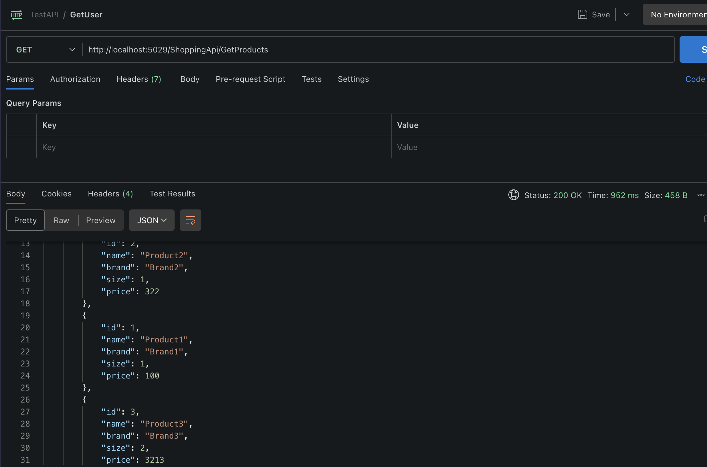
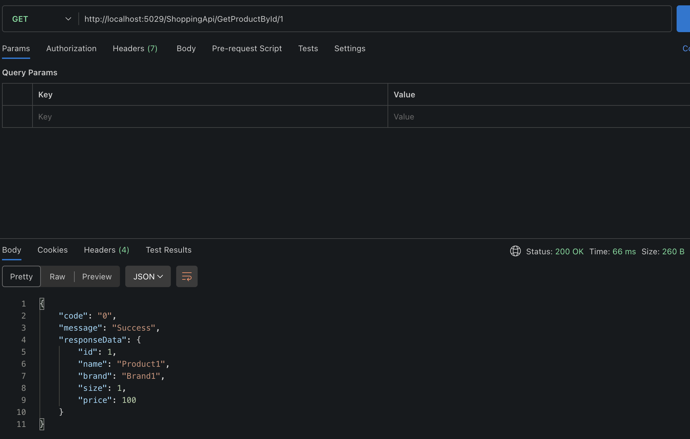
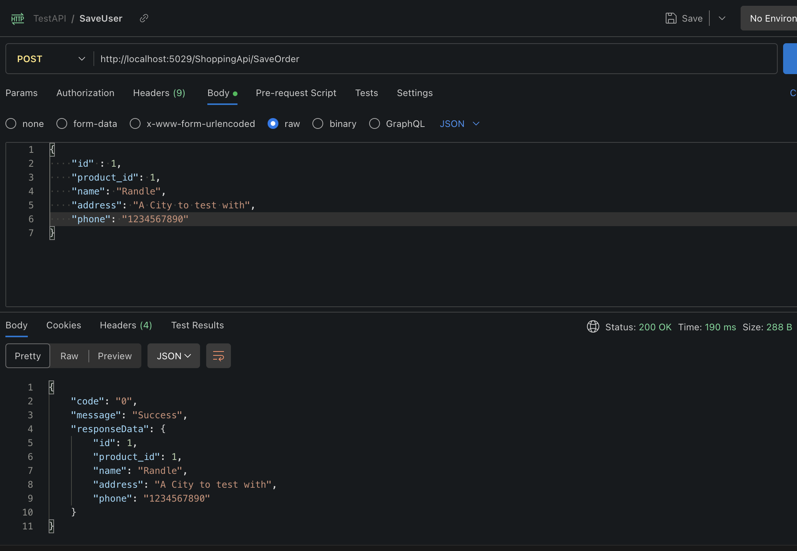
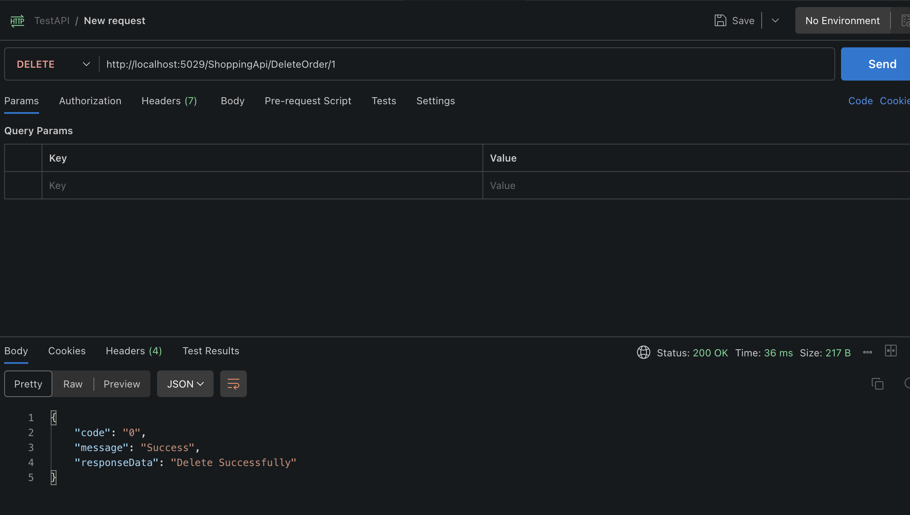
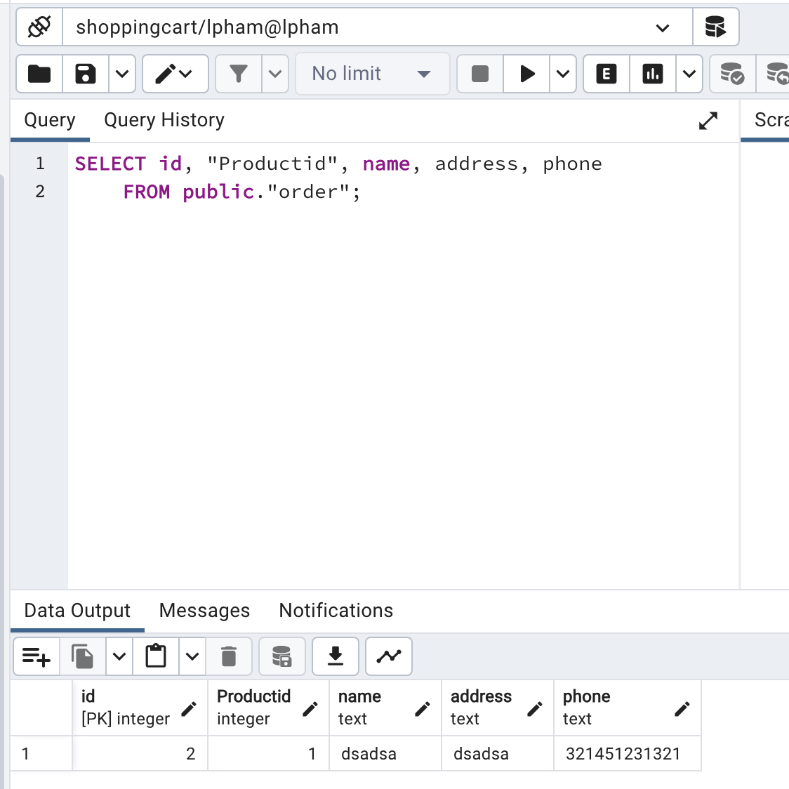
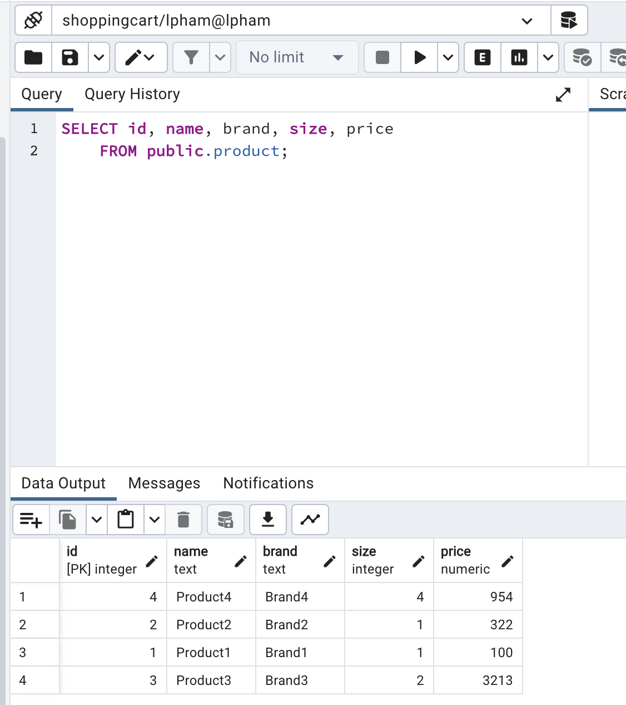

# Projects
A CRUD shopping api built with ASP.Net and PostgreSQL, and it is tested using Postman.

##GET (Products)##

##GET (by ID )##

##POST (Save Order)##

##DELETE ##

##SQL Order ##

##SQL Product ##

